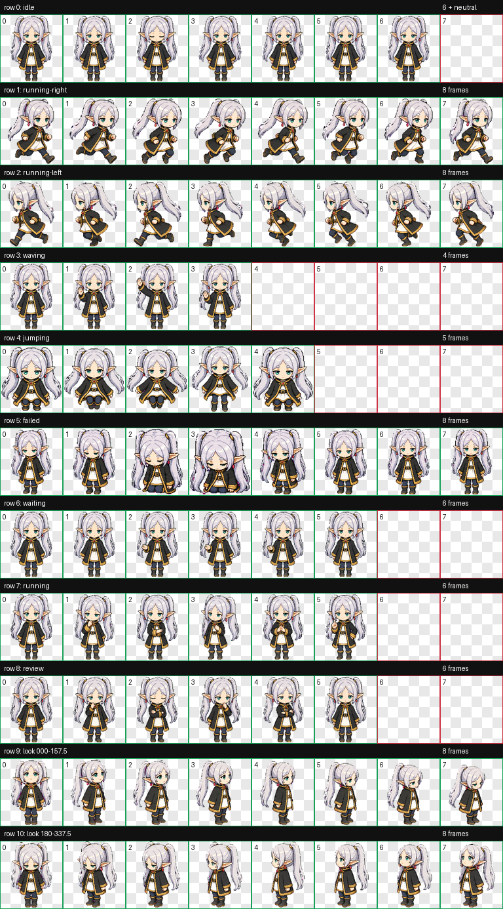

# Frieren Pixel for Codex

一只可爱、Q 版、像素风的芙莉莲主题 Codex v2 动画宠物。包含 9 组状态动画和 16 个环视方向。



## 一键安装

macOS 或 Linux：

```sh
./install.sh
```

脚本会：

- 将宠物安装到 `${CODEX_HOME:-$HOME/.codex}/pets/frieren-pixel`
- 备份已有的同名宠物和 `config.toml`
- 将 `desktop.selected-avatar-id` 设为 `custom:frieren-pixel`
- 保留重复执行的安全性

安装后重启 Codex。

## 两台电脑同步

本目录本身就是一个已提交的 Git 仓库。建议先在 GitHub 创建名为 `frieren-codex-pet` 的私有空仓库，然后在本机执行：

```sh
git remote add origin git@github.com:<你的用户名>/frieren-codex-pet.git
git push -u origin main
```

第二台电脑首次执行：

```sh
git clone git@github.com:<你的用户名>/frieren-codex-pet.git
cd frieren-codex-pet
./install.sh
```

之后更新只需：

```sh
git pull && ./install.sh
```

## 卸载

```sh
./uninstall.sh
```

宠物图集使用 Codex `spriteVersionNumber: 2`，尺寸为 `1536x2288`。

这是供个人使用的非官方同人宠物包。
