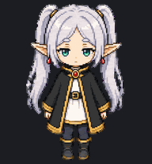
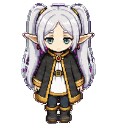

# Frieren Pixel for Codex

一只可爱、Q 版、像素风的芙莉莲主题 Codex v2 动画宠物。包含 9 组状态动画和 16 个环视方向。


## 动作与触发方式



| 动作 | Codex 中的触发方式 |
| --- | --- |
| 待机、眨眼 | 没有任务通知时自动播放 |
| 向右跑 / 向左跑 | 按住宠物并向右 / 向左拖动 |
| 挥手 | 宠物首次唤醒或出现问候提示时 |
| 轻微魔法漂浮 | 鼠标移入宠物时；Codex 会自动连续播放 3 次 |
| 轻微沮丧 | 任务失败、阻塞或出现危险级提示时；低头、闭眼停顿后缓慢回位 |
| 等待 | Codex 需要输入、确认或授权时 |
| 托腮思考 | 任务运行、思考或处理中 |
| 检查成果 | 任务成功完成、结果等待查看时 |
| 16 向注视 | Codex 在 computer-use 中移动屏幕光标时，宠物会朝该光标方向看；目前不会跟随用户自己的本地鼠标 |

这些动作及其触发条件写在 Codex 应用本身，宠物包只能提供对应行的画面，不能新增事件、快捷键或自行修改状态映射。非待机状态通常会短暂播放数轮，然后回到待机。悬浮动作已改为保持直立、最高上浮约 5 像素并眨眼，不再下蹲或落地回弹。

`spriteVersionNumber: 2` 会让图集第 10–11 行作为 16 向注视帧参与渲染。当前 Codex 版本把这些帧绑定到 `avatar-overlay-computer-use-cursor-changed`，而本地鼠标移入宠物固定触发 `jumping`。因此“本地鼠标环绕跟随”无法仅靠修改 `pet.json` 或 spritesheet 实现；若以后 Codex 开放自定义事件映射，才可以在宠物包内扩展更多互动条件。

### 思考动画优化


Codex v2 的 `running` 状态固定使用 6 帧，前 5 帧各显示 120ms，最后一帧显示 220ms。旧版在不到一秒内依次切换站立、托腮、抱臂、施法、合掌和举手，连续播放时容易显得抽搐。

新版统一使用一张托腮母帧，只加入 1 像素的整身呼吸位移，不再从待机动画移植眼睛贴图。所有帧补偿位移后的脸部锁定区域逐像素一致，首尾帧也完全一致，因此脸部和循环边界都不会跳变。除 `running` 所在的第 8 行外，其余图集行保持不变。详细验证结果见 [`qa/thinking-repair.json`](qa/thinking-repair.json)。

维护者可使用以下命令重新生成图集、动画预览和验证报告（需要 Pillow）：

```sh
python scripts/refine_thinking_animation.py \
  --input pet/frieren-pixel/spritesheet.webp \
  --output pet/frieren-pixel/spritesheet.webp \
  --preview qa/thinking-preview.gif \
  --report qa/thinking-repair.json
```

### 失败动画优化



Codex 固定将 `failed` 状态播放为 8 帧：前 7 帧各 `140ms`，最后一帧 `240ms`，并连续重复 3 次；宠物包无法覆盖这组客户端节拍。旧版在这 3.66 秒内反复执行大幅低头、坐下和重新站起，因此看起来又快又频繁。

新版把整行改成全程站立的低幅度循环：轻微低头、垂肩、闭眼停顿，再平缓回位。双脚始终锁定同一基线，角色尺度不变，首尾姿态接近，所以客户端的三次重播看起来像一次持续的沮丧停顿。除 `failed` 所在的第 6 行外，其余 10 行逐像素保持不变。详细验证结果见 [`qa/failed-repair.json`](qa/failed-repair.json)。

失败行源帧保存在 `source/failed`。维护者可使用以下命令重新装配图集、生成真实三轮预览并验证未误改其他行：

```sh
python scripts/replace_failed_animation.py \
  --input pet/frieren-pixel/spritesheet.webp \
  --frames-dir source/failed \
  --output pet/frieren-pixel/spritesheet.webp \
  --preview qa/failed-preview.gif \
  --report qa/failed-repair.json
```

## 一键安装

macOS 或 Linux：

```sh
./install.sh
```

脚本会：

- 将宠物安装到 `${CODEX_HOME:-$HOME/.codex}/pets/frieren-pixel`
- 在固定的 `frieren-pixel` 目录内原子覆盖 `pet.json` 和 `spritesheet.webp`
- 自动清理旧版安装脚本留下的 `frieren-pixel.backup-*` 重复宠物目录
- 将 `desktop.selected-avatar-id` 设为 `custom:frieren-pixel`
- 重复执行不会生成新的宠物档案或时间戳备份

安装后重启 Codex。

## 两台电脑同步

本项目已发布到私有仓库：<https://github.com/zc-xu/frieren-codex-pet>。另一台电脑需要先登录有权访问该仓库的 GitHub 账号。

第二台电脑首次执行：

```sh
git clone https://github.com/zc-xu/frieren-codex-pet.git
cd frieren-codex-pet
./install.sh
```

之后更新只需：

```sh
git pull && ./install.sh
```

安装脚本始终更新同一个宠物 ID 和目录，因此仓库更新会直接应用到当前的 Frieren Pixel 档案，不会在宠物列表中累积副本。

## 卸载

```sh
./uninstall.sh
```

宠物图集使用 Codex `spriteVersionNumber: 2`，尺寸为 `1536x2288`。

这是供个人使用的非官方同人宠物包。
